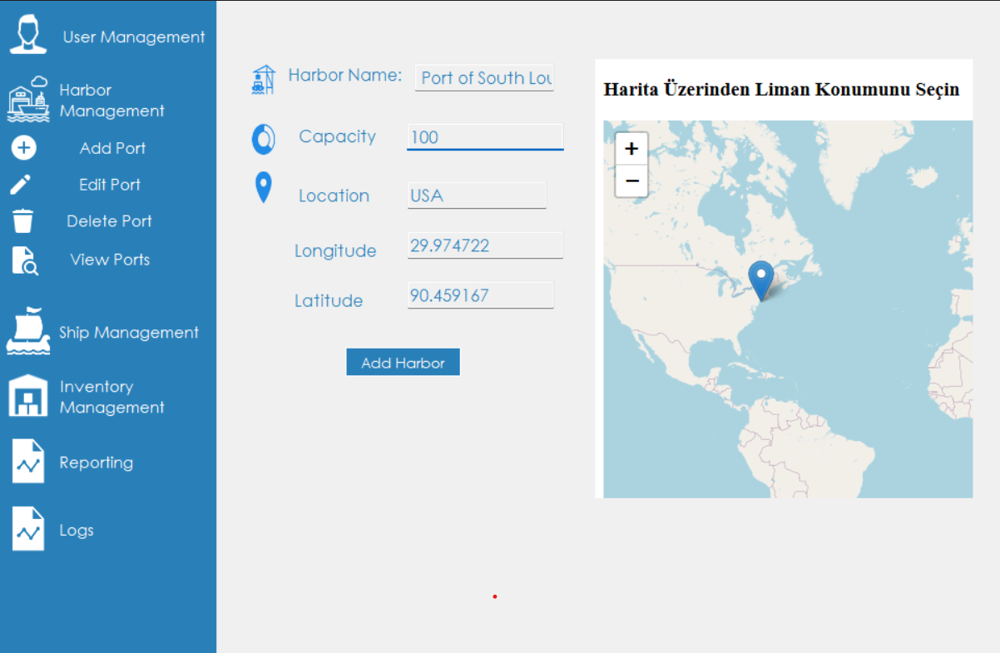
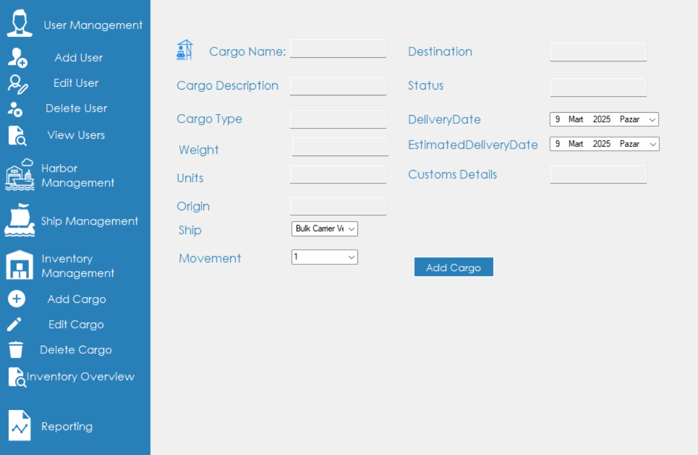
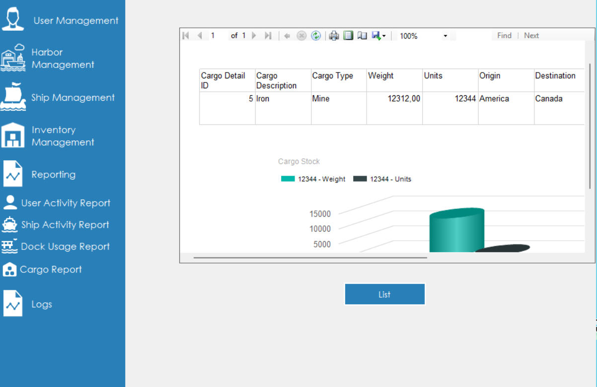
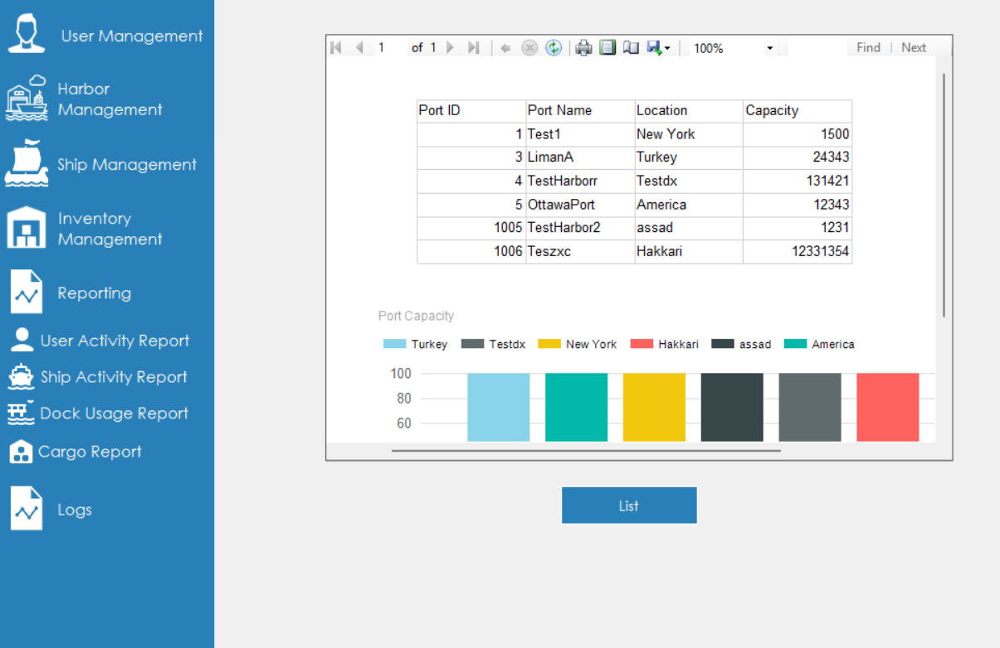

# OceanGate - Liman Takip ve Yönetim Sistemi


**OceanGate**, limanların verimli yönetilmesi için geliştirilmiş bir **C# Windows Forms** projesidir. 
Bu sistem ile **kullanıcı işlemleri, kargo yönetimi, gemi işlemleri, liman bilgileri, koordinat bazlı liman ekleme ve detaylı raporlama** gibi birçok işlemi gerçekleştirebilirsiniz.

## 🚢 Özellikler

- **🛳️ Gemi İşlemleri:** Gemi ekleme, düzenleme, kaldırma ve durum takibi.
- **📦 Kargo Yönetimi:** Kargoların limana giriş-çıkış kayıtları.
- **🏗️ Liman Yönetimi:** Koordinat bazlı liman ekleme ve düzenleme.
- **📍 Harita Entegrasyonu:** Harita üzerinden liman seçimi ve koordinat bazlı kayıt.
- **👥 Kullanıcı İşlemleri:** Kullanıcı oluşturma, giriş yetkilendirme.
- **📊 Raporlama:** Liman ve gemi hareketlerini detaylı analiz etme.
- **📜 Loglama:** Sistem işlemlerini kayıt altına alma.

## 📸 Ekran Görüntüleri










## 🛠️ Kurulum

1. **Bu repoyu klonlayın:**
   ```sh
   git clone https://github.com/kullanici/OceanGate.git
   ```
2. **Visual Studio ile açın.**
3. **Bağımlılıkları yükleyin.**
4. **Çalıştırın ve keşfedin!**

## 📌 Kullanım

1. **Giriş Yapın**: Kullanıcı adı ve şifreniz ile giriş yapın.
2. **Limanları Yönetin**: Haritadan koordinat seçerek liman ekleyin.
3. **Gemileri ve Kargoları Takip Edin**: Limana gelen gemileri ve taşıdıkları yükleri yönetin.
4. **Raporlar ve Analizler**: Liman hareketlerini detaylı raporlayın.

